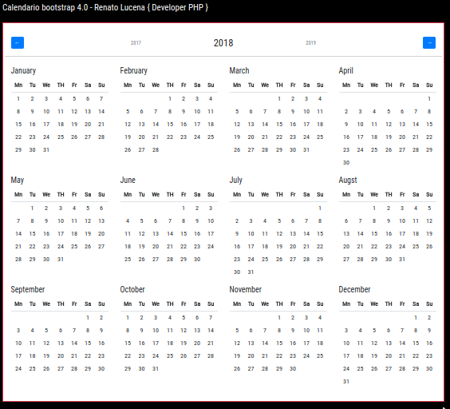

# Calendar Design using bootstrap 4.0

Esta é a demonstração do calendário de ano inteiro usando o calendário do ano de bootstrap jquery. neste calendário você pode exibir todo o mês do ano. você pode mostrar o mês do ano anterior e o mês do ano passado. Usando este plugin jquery você pode exibir o calendário do ano completo. é um exemplo de código fonte com demonstração ao vivo. 

Nós permite a livre trechos de calendário de ano de bootstrap, você pode baixar o código completo de layout de código de exemplo de calendário de inicialização. Aqui neste post vou dar-lhe exemplo de snippet de calendário responsivo bootstrap e você receberá código simples de html, css e jquery. Em bootstrap calendar jquery plugin trecho eu dou-lhe três aba com html, css e js, você pode facilmente obter o código de layout de origem de eventos de calendário de inicialização.

## Exemplo:

- http://nicesnippets.com/live/bootstrap-4-all-year-calendar-example-demo.html

## Fonte

- http://nicesnippets.com/snippet/bootstrap-4-all-year-calendar-example?utm_source=feedburner&utm_medium=email&utm_campaign=Feed%3A+Nicesnippets+%28Nicesnippets.com%29

- links css:

	<link rel="stylesheet" type="text/css" href="https://www.jqueryscript.net/demo/Year-Calendar-Bootstrap-4/jquery.bootstrap.year.calendar.css">
	<link rel="stylesheet" href="https://maxcdn.bootstrapcdn.com/bootstrap/4.0.0/css/bootstrap.min.css" integrity="sha384-Gn5384xqQ1aoWXA+058RXPxPg6fy4IWvTNh0E263XmFcJlSAwiGgFAW/dAiS6JXm" crossorigin="anonymous">
	<link href="https://fonts.googleapis.com/css?family=Roboto+Condensed" rel="stylesheet">

- links js:

	
	
	<script src="https://www.jqueryscript.net/demo/Year-Calendar-Bootstrap-4/jquery.bootstrap.year.calendar.js">

### Renato Lucena { Developer PHP }
